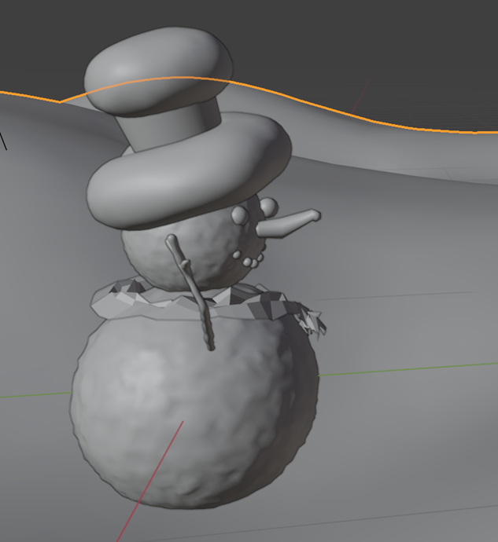
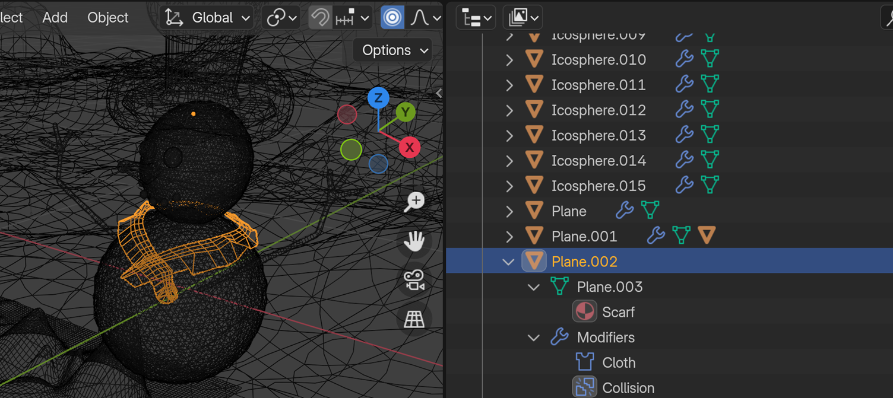
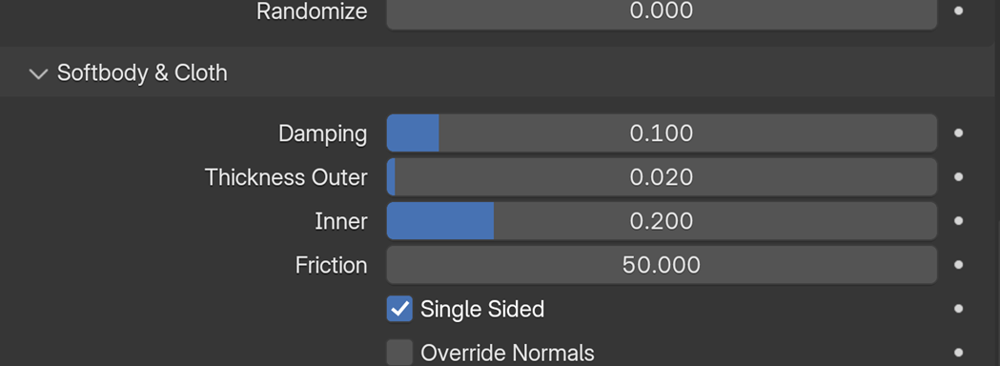
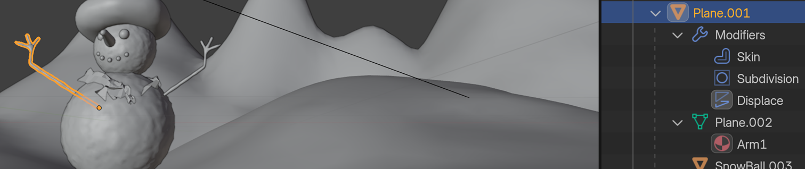
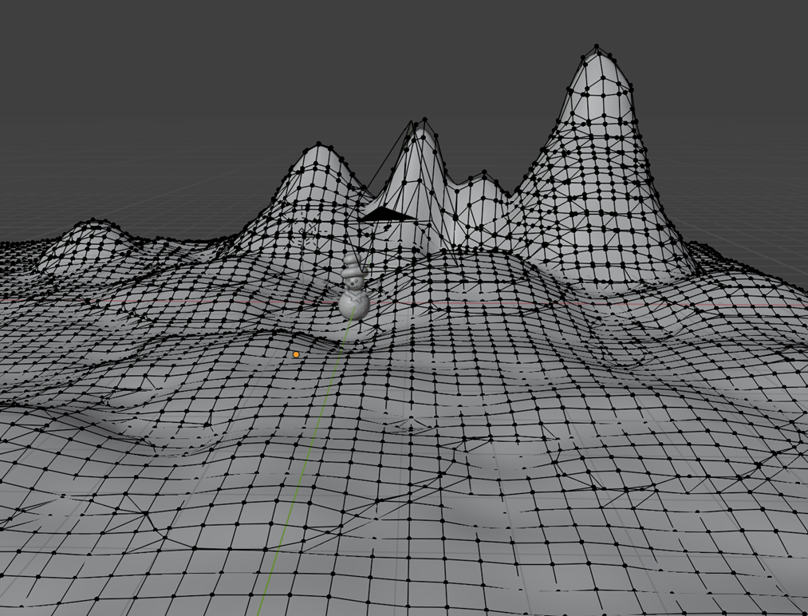
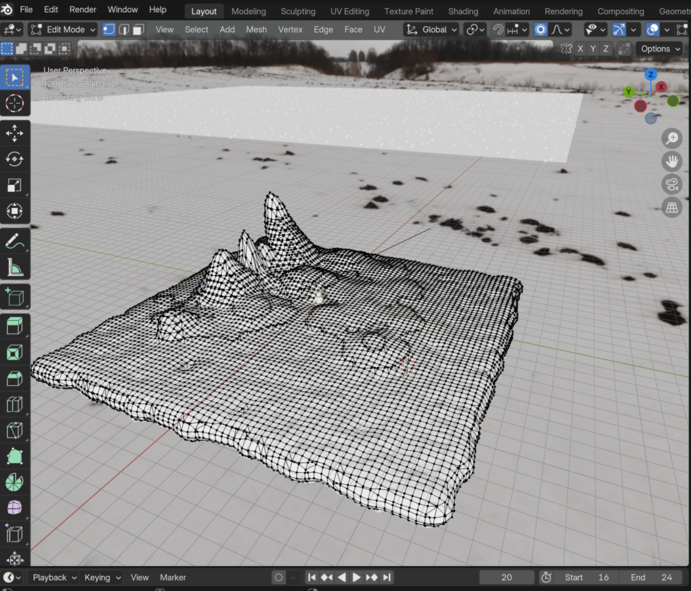
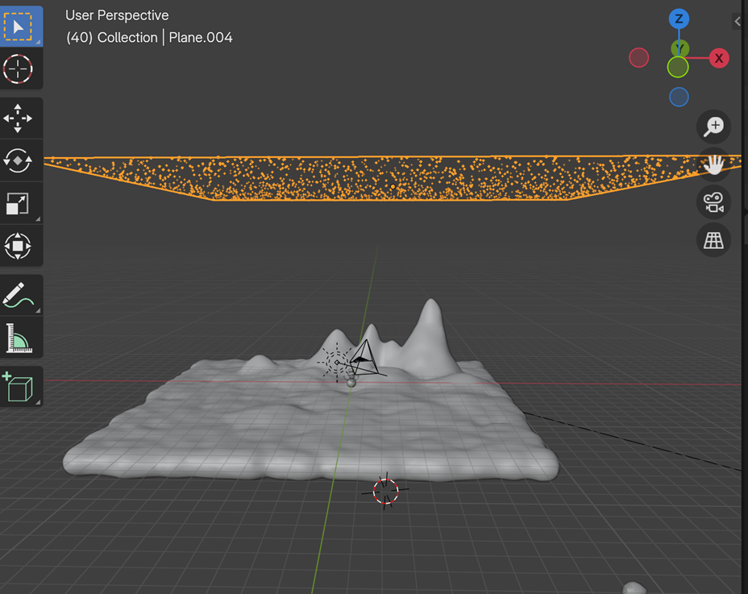
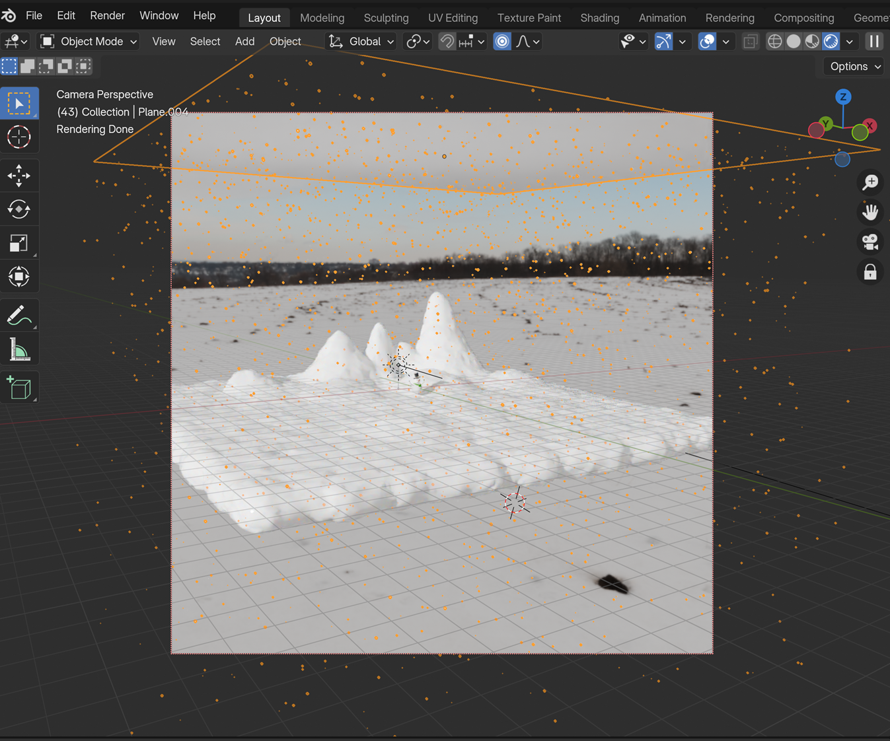
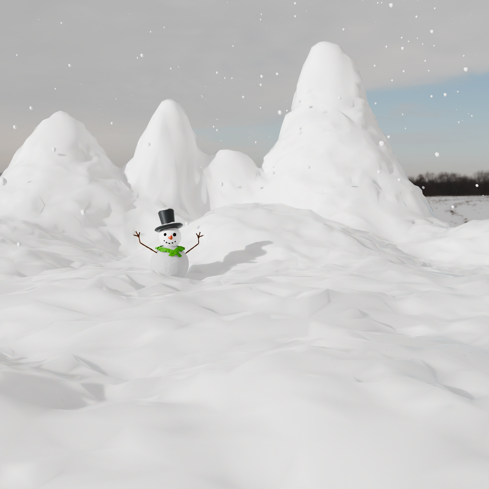

# Snowman Animation Project

[![Watch the video]](Snowman_Animation.mp4)

https://github.com/user-attachments/assets/96b3b6f0-8056-4aef-8b82-671645175839

This project involves the creation and animation of a snowman scene using Blender. The goal was to design a winter-themed visual by constructing a snowman, adding a scarf, simulating falling snow, and positioning the scene against a backdrop of mountains. 

## Project Details

### Scene Elements

- **Snowman**: The primary focus of the scene, the snowman, is constructed using 2 icospheres stacked to form the classic snowman shape.
  - **Eyes**: Small icospheres were used for the eyes.
  - **Nose**: A cylinder represents the carrot nose.
  - **Arms**: A plane was used to make the two arms.
  - **Hat**: A cylinder was used to create the hat.
  - **Lips**: An icosphere was used to create the snowman's smile.
  - **Scarf**: A plane was used to model and texture the scarf, which wraps around the snowman's neck.

- **Falling Snow**: A particle system applied to a plane was used to simulate falling snow, adding movement and a dynamic atmosphere to the scene.

- **Mountains**: The backdrop consists of mountains modeled with a plane using proportional editing to create a terrain effect.

- **Snow**: The RealSnow add-on was used to give the environment a realistic snowy effect. Icospheres were also utilized to create realistic snowballs.

- **Environment**: Procedural textures and HDRI lighting (downloaded from Poly Haven) were used to enhance the realism of the scene.

- **Lighting**: A sun lamp was positioned and adjusted to cast shadows, making the scene more realistic.

### Modeling Techniques

- **Snowman Body**: The snowman's body was created with icospheres and modified using the Displace object modifier to make it lumpy and bumpy, simulating the appearance of a real snowman. A subdivision modifier was also applied to add smoothness. To change the texture, a procedural texture type as ‘Cloud’ was used.

- **Hat**: A cylinder was used to make the hat. After puƫting the cylinder at the top of the face, I went into wireframe mode and selected 
the bottom half of the hat to scale it down to make it feel more realistic and tapered. Then, to add the brim of the hat, I used ‘e’ key to extrude and then ‘s’ to scale, resulting in the brim.

- **Scarf**: - A Cloth modifier was used to create the scarf of the snowman. Collison from ‘Physics’ was used so that when the cloth comes down, it has to collide with the object. To stop it from moving after it has collided with the object, I added friction = 50.

- **Arms**: The snowman's arms were created using a plane and modified with the Skin, Subdivision, and Displace modifiers for a realistic appearance.

- **Mountains and Terrain**: Upon the lower plane, proportional editing was used to give it an effect of terrain. I divided the plane into sub-divisions and then used proportional editing to carve out terrain and mountains and then used the RealSnow add-on to give the snowy effect.

- **Snowfall**: The particle system was used to create falling snow, and additional snow was added to the snowman’s hat to enhance realism.

### Final Render

- The final scene was rendered with the following details:
  - Image Format: PNG
  - Dimensions: Various resolutions (up to 2550x2182)
  - Color: Truecolor with alpha
  - Interlaced: Yes

## Highlights

- **Wireframe, Solid, and Material Preview**: Different views of the snowman model were used during the creation process to ensure proper detailing.
- **Modifier Usage**: Various modifiers like Displace, Subdivision, and Cloth were used to achieve realistic effects.
