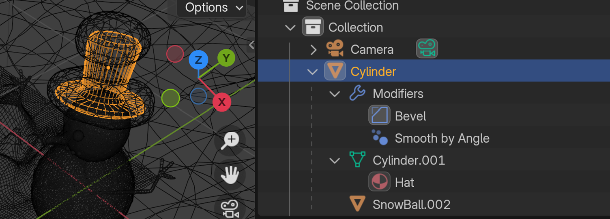

# Snowman Animation Project

This project involves the creation and animation of a snowman scene using Blender. The goal was to design a winter-themed visual by constructing a snowman, adding a scarf, simulating falling snow, and positioning the scene against a backdrop of mountains. 

## Project Details

### Scene Elements

- **Snowman**: The primary focus of the scene, the snowman, is constructed using 2 icospheres stacked to form the classic snowman shape.
  - **Eyes**: Small icospheres were used for the eyes.
  - **Nose**: A cylinder represents the carrot nose.
  - **Arms**: A plane was used to make the two arms.
  - **Hat**: A cylinder was used to create the hat.
  - **Lips**: An icosphere was used to create the snowman's smile.
  - **Scarf**: A plane was used to model and texture the scarf, which wraps around the snowman's neck.

- **Falling Snow**: A particle system applied to a plane was used to simulate falling snow, adding movement and a dynamic atmosphere to the scene.

- **Mountains**: The backdrop consists of mountains modeled with a plane using proportional editing to create a terrain effect.

- **Snow**: The RealSnow add-on was used to give the environment a realistic snowy effect. Icospheres were also utilized to create realistic snowballs.

- **Environment**: Procedural textures and HDRI lighting (downloaded from Poly Haven) were used to enhance the realism of the scene.

- **Lighting**: A sun lamp was positioned and adjusted to cast shadows, making the scene more realistic.

### Modeling Techniques

- **Snowman Body**: The snowman's body was created with icospheres and modified using the Displace object modifier to make it lumpy and bumpy, simulating the appearance of a real snowman. A subdivision modifier was also applied to add smoothness. To change the texture, procedural texture type as ‘Cloud’ was used.

- **Hat**: The hat was modeled from a cylinder. The bottom half was scaled down to give a tapered effect, and the brim was created by extruding and scaling the bottom face.

- **Scarf**: A cloth modifier was used for the scarf, with collision settings applied to ensure it interacts realistically with the snowman. Friction was set to 50 to stop movement upon collision.

- **Arms**: The snowman's arms were created using a plane and modified with the Skin, Subdivision, and Displace modifiers for a realistic appearance.

- **Mountains and Terrain**: A plane was subdivided and edited using proportional editing to form the terrain and mountains. The RealSnow add-on was then used to add snow to the landscape.

- **Snowfall**: The particle system was used to create falling snow, and additional snow was added to the snowman’s hat to enhance realism.

### Final Render

- The final scene was rendered with the following details:
  - Image Format: PNG
  - Dimensions: Various resolutions (up to 2550x2182)
  - Color: Truecolor with alpha
  - Interlaced: Yes

## Highlights

- **Wireframe, Solid, and Material Preview**: Different views of the snowman model were used during the creation process to ensure proper detailing.
- **Modifier Usage**: Various modifiers like Displace, Subdivision, and Cloth were used to achieve realistic effects.
